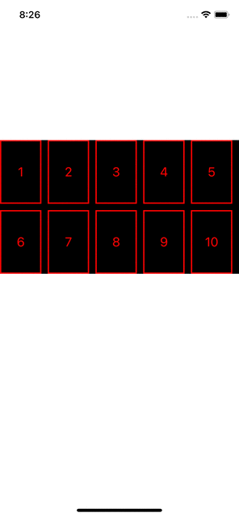

# WHorizontalPageableFlowLayout
Horizontal Pageable Flow Layout For CollectionView

## install
```
brew install WHorizontalPageableFlowLayout
``` 

## use
```
    #define SCREEN_WIDTH   [UIScreen mainScreen].bounds.size.width
    
    static const NSUInteger kMaxRowCount = 2;
    static const NSUInteger kItemCountPerRow = 5;
    
    WHorizontalPageableFlowLayout *flowLayout = [[WHorizontalPageableFlowLayout alloc] init];
    flowLayout.maxCountPerRow = kItemCountPerRow;
    flowLayout.rowCount = kMaxRowCount;
    CGFloat space = 10;
    flowLayout.minimumLineSpacing = space;
    flowLayout.minimumInteritemSpacing = space;
    flowLayout.itemSize = CGSizeMake((SCREEN_WIDTH-kItemCountPerRow*space)/kItemCountPerRow, 100);

```

## rendering
